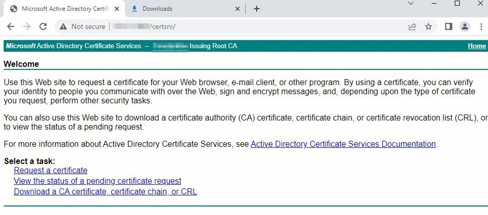
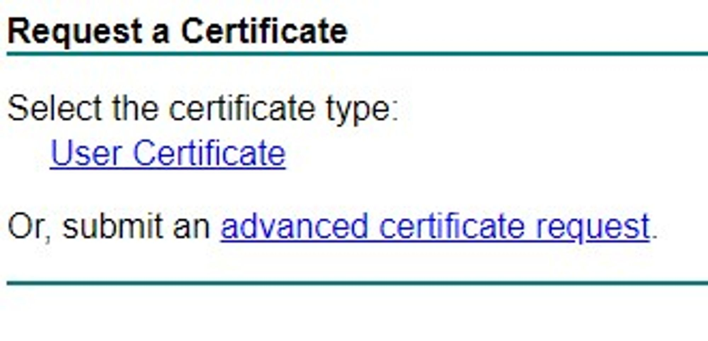
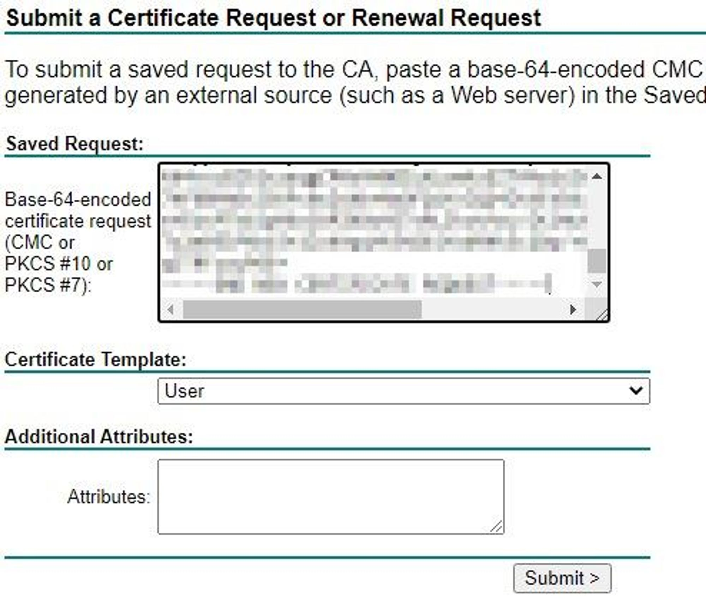
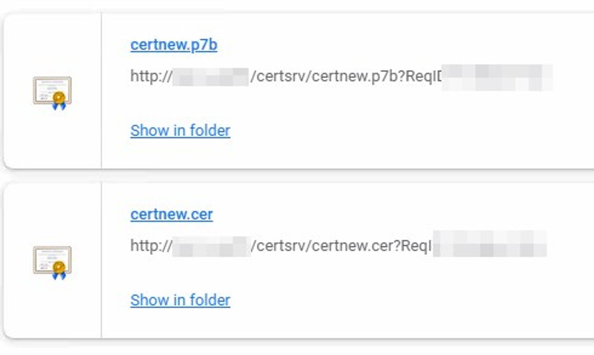

## Generating a CSR

Generate a CSR from another server, doing this from IIS is a tried and tested method.

## Submitting the request to the CA

:::tip Certificate Authority websißte URL
Enter the address of your CA followed by `/certsrv` for example `http://ca server name/certsrv` in the Address bar.
:::

Open a **web browser**.
Browse to your **Certificate Authority website**.

Click Request a Certificate. Navigate to your Certificate Authorities certsrv URL.

Click submit an advanced certificate request.

Paste in the CSR.

:::tip Certificate template
Make sure to change the template you want to use if that is applicable.
:::

## Completing the Request

Your certificate should be approved almost instantly and some download options will appear. Select whatever download option is best for you; I'd suggest renaming the certificate file you download, it'll have a generic name otherwise.

:::tip
The chain option downloads the Certificate Authority certs (Root and Sub-CAs in the chain) as well, all the way back to the root ca.
:::
