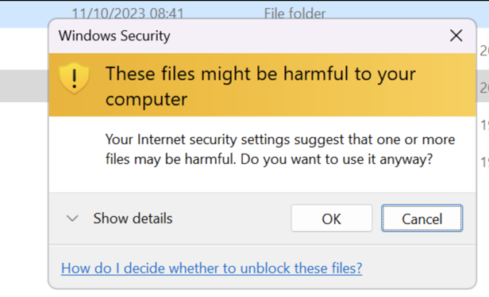

## The Error message

This prompt will be shown to a user when access on-prem file shares.

## Scenario

- Users have OneDrive Configured on their endpoints and an on-premise file server mapped.
- Authentication to the on-premise drive is done via WHfB.
- When moving documents between OneDrive and the on-premise file server. There’s a windows prompt saying that these files might be harmful to your computer.

## Remediation

Add references to the locations in the IE trusted sites locations using intune Policy.

1. Created a Device Configuration Profile, Settings catalog.
2. Find the settings.
3. Windows Components > Internet Explorer > Internet Control Panel > Security Page
4. Enter the info in the format below.

- .sharepointonline.com, 2
- https://autologon.microsoftazuread-sso.com, 1
- file://*.customerdomain.co.uk, 1
