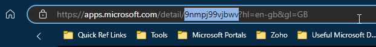

:::warning Run as the user

These steps will only work if PowerShell is not blocked by policy. The command line tool must be running in the user context otherwise the app cannot be installed.

:::

Firstly, navigate to the web based version of the MS Store and locate your application.

[Microsoft Store link](https://apps.microsoft.com/home?hl=en-gb&gl=GB)

Note the name of your app and the App ID from the url.



:::note Installing WinGet

You'll need the WinGet module, it normally comes with Windows but, just in case, `Add-AppxPackage -RegisterByFamilyName -MainPackage Microsoft.DesktopAppInstaller_8wekyb3d8bbwe`

:::

To install the application you need try the commands below, you can search the store too using WinGet commands however, sometimes the application naming is different to what you would expect.

```powershell

# Search by App Name
Winget search 'Company Portal' --source msstore

# Search by App ID
Winget search '9NMPJ99VJBWV' --source msstore

# Install the app
WinGet install '9NMPJ99VJBWV' --source msstore

```
