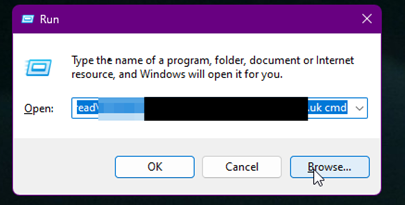
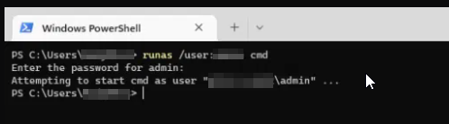

Press and hold down the Windows key on the keyboard and then, whilst holding the Windows key press the letter R.

A small box called “Run” should appear in the bottom left corner of the screen.

In the box, you want to type the following:

`Runas /user:azuread\username@domain.co.uk cmd`

Then, type PowerShell to launch the app within the same window.

To launch PowerShell as an elevated prompt, in the window type `Start-Process PowerShell.exe -Verb RunAs` (the capitalisation doesn't matter.)
